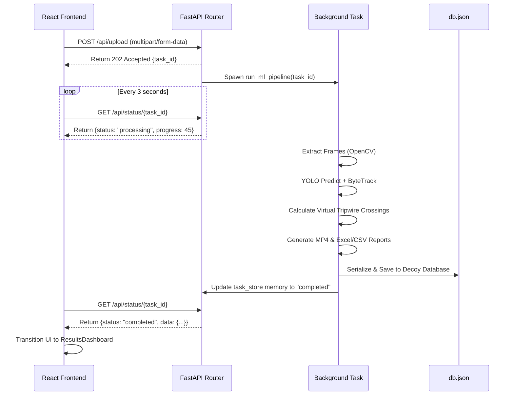

# 🚁 Smart Drone Traffic Analyzer

A high-performance, edge-capable Computer Vision application designed to analyze aerial drone footage, track moving vehicles, and generate frame-accurate data reports. 

Built with a **React + Tailwind** frontend and a **FastAPI + YOLOv11** backend, this system is optimized for real-time tracking, aesthetic UI design, and robust data exports.

---

## 📑 Table of Contents
1. [Tech Stack & Architecture](#%EF%B8%8F-tech-stack--architecture)
2. [Project Structure](#-project-structure)
3. [Deep Dive: Tracking Methodology & ML Tuning](#-deep-dive-tracking-methodology--ml-tuning)
4. [Deep Dive: Frontend State & UI](#-deep-dive-frontend-state--ui)
5. [API Documentation](#-api-documentation)
6. [Engineering Assumptions & Limitations](#%EF%B8%8F-engineering-assumptions--limitations)
7. [Step-by-Step Local Setup](#-step-by-step-local-setup)
8. [Production Deployment Recommendations](#-production-deployment-recommendations)

---

## 🛠️ Tech Stack & Architecture

### Frontend (Client-Side)
*   **Framework:** React 18 (Vite)
*   **Styling:** Tailwind CSS + custom glassmorphism utilities (`index.css`)
*   **Components:** Radix UI primitives / shadcn-like patterns
*   **Icons & Toasts:** Lucide React, Sonner (for non-blocking UI alerts)
*   **State Management:** React Hooks (`useState`, `useEffect`, `useRef`)

### Backend (Server-Side)
*   **Framework:** FastAPI (Python 3.10+)
*   **Computer Vision Model:** Ultralytics YOLOv11 (Nano - `yolo11n.pt`)
*   **Object Tracker:** ByteTrack (Multi-Object Tracking)
*   **Video Processing:** OpenCV (`cv2`)
*   **Data Exporting:** Pandas, OpenPyXL (for rich Excel formatting)
*   **Database:** Decoy Database (`db.json`) for persistence

### System Architecture & Async Flow



**Why BackgroundTasks?** Video processing is heavily CPU-bound. If processed synchronously on the main thread, the FastAPI server would lock up and refuse new connections (or even status checks). By handing the video to a `BackgroundTask`, the server remains responsive to the frontend's long-polling `GET` requests, allowing for a smooth loading bar experience.

---

## 📂 Project Structure

```text
smart-drone-traffic-analyzer/
├── backend/
│   ├── main.py                  # FastAPI entry point, Routes, & Task State Store
│   ├── db.json                  # "Decoy Database" for persistent history
│   ├── services/
│   │   ├── video_processor.py   # Main orchestration loop for OpenCV frame extraction
│   │   ├── detection.py         # YOLO model initialization and class filtering
│   │   ├── tracking.py          # ByteTrack configuration and bounding box extraction
│   │   ├── counting.py          # Virtual tripwire logic and coordinate math
│   │   └── reporting.py         # Pandas DataFrame construction & OpenPyXL styling
│   └── utils/
│       └── video_utils.py       # Drawing bounding boxes, labels, and count overlays
├── frontend/
│   ├── src/
│   │   ├── App.jsx              # Main React State Machine & Routing
│   │   ├── index.css            # Tailwind directives and custom animations
│   │   └── components/
│   │       ├── FileUploader.jsx # Drag-and-drop file ingestion
│   │       ├── ResultsDashboard.# The main interactive data view
│   │       ├── StatusIndicator. # Animated loading bar
│   │       └── ui/              # Reusable UI primitives (Buttons, Cards, Progress)
│   ├── package.json
│   └── vite.config.js
├── requirements.txt             # Python dependencies
└── README.md
```

---

## 🧠 Deep Dive: Tracking Methodology & ML Tuning

The core ML pipeline is driven by **YOLOv11 Nano** coupled with the **ByteTrack** algorithm. 

### 1. The Virtual Tripwire (Counting Logic)
We implemented a unidirectional virtual tripwire. 
*   **Placement:** A horizontal line is drawn at 60% of the video's vertical height (`y = int(h * 0.6)`). 
*   **Trigger:** As vehicles move down the frame, their center coordinates `(cx, cy)` are calculated. If the previous frame's `cy` was *above* the line, and the current frame's `cy` is *below* the line, a count is triggered.

### 2. Defeating Double-Counting
A common flaw in rudimentary trackers is double-counting a vehicle if it hesitates on the line or if the bounding box flickers. 
*   **The Fix:** We maintain a set of counted trackers: `self.counted_ids = set()`. Once a ByteTrack unique ID successfully crosses the line, it is permanently logged into this set. The system enforces an `if track_id not in self.counted_ids:` check before incrementing the counter, making double-counting physically impossible for a stable track.

### 3. Tuning Non-Maximum Suppression (NMS)
When drones film from a top-down angle, large vehicles in parallel lanes (e.g., a bus passing a truck) will have heavily overlapping bounding boxes from the 2D camera's perspective. By default, YOLO's NMS filter deletes overlapping boxes, assuming they are duplicate detections of the same object.
*   **The Fix:** We aggressively increased the tracking NMS IoU threshold (`iou=0.85`). This instructs the AI to allow bounding boxes to overlap by up to 85% before suppressing one, ensuring both vehicles are tracked independently.

### 4. Handling Occlusion (Hidden Vehicles)
If a truck partially blocks a motorcycle, the AI's confidence in the motorcycle drops. If it drops below the threshold, the track is lost.
*   **The Fix:** We lowered the base detection confidence (`conf=0.15`). We rely on ByteTrack's multi-stage association (which uses low-confidence detections specifically to recover lost tracks) to keep the hidden vehicle alive. 

---

## 🎨 Deep Dive: Frontend State & UI

The frontend is governed by a strict state machine inside `App.jsx`:
`['IDLE', 'UPLOADING', 'PROCESSING', 'COMPLETED', 'ERROR']`

*   **Glassmorphism Engine:** We utilized complex Tailwind gradients (`bg-slate-900/40 backdrop-blur-xl`) alongside an animated CSS shine effect (`index.css: .glass-panel::before`) to create a "Cyber-City" aesthetic.
*   **Focus Mode SVG Masking:** In the `ResultsDashboard`, when a user clicks a detection log, the app reads the `[x1, y1, x2, y2]` bounding box coordinates from the backend data. It dynamically generates an `<svg><mask/></svg>` element overlaid on the video player, instantly plunging the screen into darkness while spotlighting only the targeted vehicle.
*   **Mobile Responsiveness:** The UI grid heavily utilizes `flex-col md:flex-row` directives. Data tables are wrapped in `overflow-x-auto` to allow horizontal swiping on mobile devices without breaking the flex layout.

---

## 🔌 API Documentation

### `POST /api/upload`
Accepts a `multipart/form-data` video file. Saves it to disk and spawns a background tracking thread.
*   **Returns:** `{"task_id": "uuid-string"}`

### `GET /api/status/{task_id}`
Polled by the frontend to check tracking progress.
*   **Returns (Pending):** `{"status": "processing", "progress": 45}`
*   **Returns (Completed):** `{"status": "completed", "data": { counts, events, urls... }}`

### `GET /api/history`
Reads the `db.json` Decoy Database and returns an array of all past analyses.
*   **Returns:** `[{ task_id, timestamp, original_filename, total_vehicles, data }]`

### `DELETE /api/history/{task_id}`
Permanently removes an analysis record from the database.

---

## 🏗️ Engineering Assumptions & Limitations

1.  **Perspective & Altitude:** The system assumes the drone is hovering stationary or moving extremely slowly, pointing downwards at an angle parallel to the flow of traffic. Heavy camera rotation will break the static virtual tripwire.
2.  **Hardware Profiling:** The system defaults to CPU inference using the `yolo11n.pt` (Nano) model to ensure the project runs locally on standard laptops. If a CUDA-enabled NVIDIA GPU is detected, PyTorch will automatically accelerate it, allowing for larger models (`yolo11m.pt`) to be used without severe latency penalties.
3.  **Decoy Database vs. SQL:** We utilized a flat `db.json` file to store historical analysis records. This allows users to test database capabilities (fetching history, deleting records) without the friction of installing PostgreSQL or Docker. It is entirely sufficient for prototyping, though a production app would migrate this logic to an ORM (like SQLAlchemy).

---

## 🚀 Step-by-Step Local Setup

### Prerequisites
*   **Python 3.10+**
*   **Node.js 18+** & npm

### 1. Clone the Repository
```bash
git clone https://github.com/yourusername/smart-drone-traffic-analyzer.git
cd smart-drone-traffic-analyzer
```

### 2. Backend Setup (FastAPI + YOLO)
Open a terminal in the root directory:
```bash
# Create a virtual environment
python -m venv venv

# Activate it (Linux/Mac)
source venv/bin/activate
# Or on Windows: venv\Scripts\activate

# Install Python dependencies
pip install -r requirements.txt

# Start the FastAPI server
uvicorn backend.main:app --reload
```
*The backend will now be running on http://127.0.0.1:8000*

### 3. Frontend Setup (React + Vite)
Open a **second** terminal window:
```bash
cd frontend

# Install Node modules
npm install

# Start the Vite development server
npm run dev
```
*The frontend will now be running on http://localhost:3000*

### 4. Usage
1. Open the frontend in your browser.
2. Upload a `.mp4` drone traffic video.
3. Wait for the background ML pipeline to process the frames.
4. Interact with the generated "Precision Analysis Feed".
5. Export your data as a beautifully formatted `.xlsx` or raw `.csv`.
6. Use the "View Past Analyses" button to load old records from the Decoy Database!